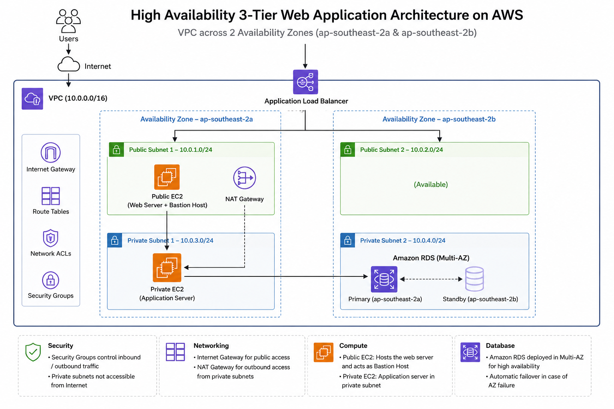
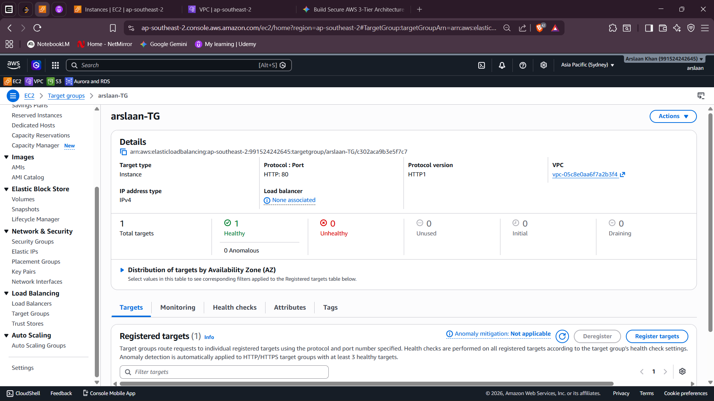
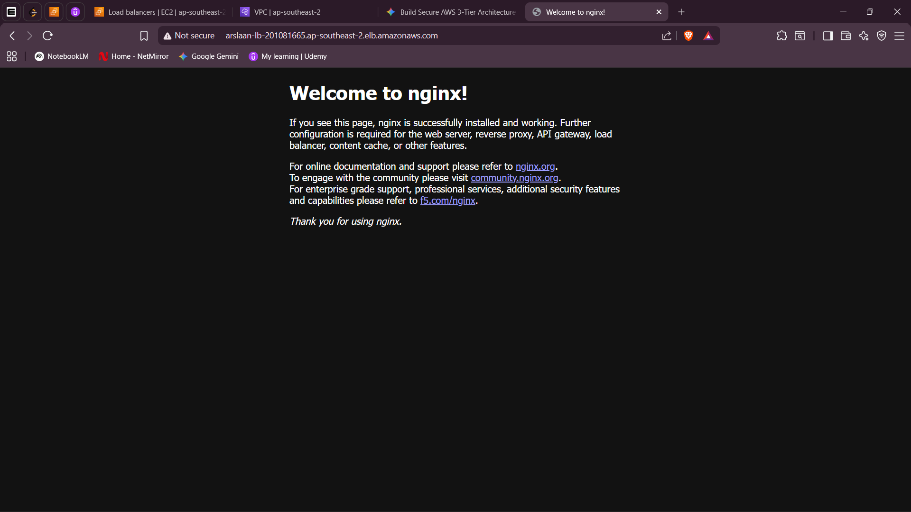

# aws-secure-3tier-web-architecture
an industry-standard, secure, and highly available 3-Tier Web Application infrastructure deployed manually on AWS across multiple Availability Zones (`ap-southeast-2a` &amp; `ap-southeast-2b`). This architecture isolates the presentation, application, and data layers to ensure maximum security, fault tolerance, and modular scalability. 
# High Availability 3-Tier Web Application Architecture on AWS

An industry-standard, secure, and highly available 3-Tier Web Application infrastructure deployed manually on AWS across multiple Availability Zones (`ap-southeast-2a` & `ap-southeast-2b`). This architecture isolates the presentation, application, and data layers to ensure maximum security, fault tolerance, and modular scalability.

---

## 🗺️ Architecture Overview

The infrastructure is built entirely within a custom VPC (`10.0.0.0/16`) and consists of the following isolated layers:
1. **Presentation Layer (Public Subnets):** Houses an external Application Load Balancer (ALB) spanning both AZs to route user traffic, alongside a Public EC2 Web Server acting as a reverse proxy (Nginx) and Bastion Host.
2. **Application Layer (Private Compute Subnet):** Hosts the isolated backend Application Server (EC2) accessible only through the presentation tier via strict security groups.
3. **Data Layer (Private Database Subnet):** Features an isolated Amazon RDS MySQL database tier completely locked down from internet exposure.

---

## 🚀 Key Features & Engineering Choices

* **High Availability Endpoint:** The Application Load Balancer is deployed across two distinct Public Subnets to satisfy multi-AZ routing criteria and handle automatic failovers.
* **Network Isolation:** Private subnets have zero direct inbound paths from the internet. The backend application server securely fetches outbound system updates via an attached **NAT Gateway**.
* **Tiered Security Groups:** Strict stateful firewalls are implemented at every layer:
  * **ALB Security Group:** Allows public HTTP (`Port 80`) traffic from anywhere (`0.0.0.0/0`).
  * **Public Web Security Group:** Restricts web traffic incoming strictly from the ALB.
  * **Private DB Security Group:** Restricts MySQL inbound access (`Port 3306`) exclusively to the private application tier.

---

## ⚙️ Services Deployed

* **Networking:** Amazon VPC, Internet Gateway (IGW), NAT Gateway, Route Tables
* **Compute:** Amazon EC2 (Nginx Web Server & Application Instances)
* **Elastic Load Balancing:** Application Load Balancer (ALB) with health checks pointing to healthy target groups
* **Database:** Amazon RDS (MySQL Engine)

---

## 📸 Verification & Screenshots

### 1. Fully Healthy ALB Target Groups
*Add your screenshot here showing your registered EC2 targets reporting a `Healthy` status.*

### 2. Live Public Application Access
*Add your screenshot of the successful Nginx welcome/landing page accessed via your ALB's DNS link.*

---

## 🛠️ Step-by-Step Implementation Lab

1. **VPC Creation:** Configured a `10.0.0.0/16` CIDR block alongside an attached Internet Gateway.
2. **Subnet Layering:** Partitioned the network into 2 Public Subnets (for ALB/NAT/Bastion) and 2 Private Subnets (for App/DB compute).
3. **Route Tables:** Maintained public route paths through the IGW and paired a private route table routing outbound traffic safely through the NAT Gateway.
4. **Compute Provisioning:** Created the public-facing Nginx web proxy and a secure, private backend instance.
5. **Database Deployment:** Provisioned an isolated Amazon RDS MySQL database instance inside the private data subnet group.
6. **Traffic Regulation:** Tied everything together using target groups and an Application Load Balancer to achieve a completely functional and highly available system loop.
